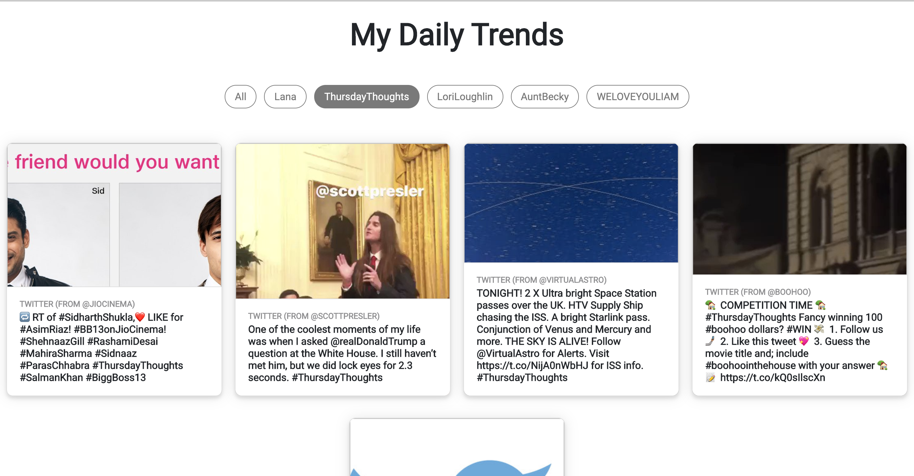

# My Daily Trends - Research Project by Alexis Echano
Senior Thesis in the Mobile/Web App Development Lab at TJHSST --> [Link to project](https://user.tjhsst.edu/2020aechano/home "My Daily Trends")
Main file is SERVER.PY

Only public files, still a work in progress :)

Built using:
* Python Flask
* HTML
* CSS
* Bootstrap
* MySQL
* Tweepy (Twitter API in Python)
* Facebook Scraper (credits to the creator)

Originally Hosted on TJ's Director Platform

## Example on website

